# pet_house

반려동물 분양/입양을 위한 풀스택 프로젝트입니다.  
프론트엔드는 Next.js 기반의 사용자 화면을 제공하고, 백엔드는 Spring Boot 기반 REST API와 인증, 계약 관리 기능을 담당합니다.

## Overview

- 분양글 목록 조회
- 분양글 상세 조회
- 입양 신청
- 분양 등록
- 로그인 / 회원가입
- 계약 관리
  - 관리자 전용 접근
  - 계약 목록 조회
  - 분양글별 계약 상세 조회
  - 분양 완료 / 관리자 취소 처리

## Tech Stack

### Frontend

- Next.js 16
- React 19
- TypeScript
- Tailwind CSS 4

### Backend

- Spring Boot 3.5.13
- Java 17
- Spring Web
- Spring Data JPA
- Spring Security
- JWT
- Gradle

### Database

- MySQL
- H2 (개발/테스트 보조)

## Directory Structure

```text
pet_house/
├─ ani_front/   # Next.js frontend
├─ ani_Back/    # Spring Boot backend
├─ README.md
└─ .gitignore
```

## Frontend Structure

주요 페이지:

- `ani_front/app/page.tsx`
  - 메인 분양글 목록
- `ani_front/app/adoption/page.tsx`
  - 분양 상세 / 입양 신청
- `ani_front/app/registration/page.tsx`
  - 분양 등록
- `ani_front/app/login/page.tsx`
  - 로그인
- `ani_front/app/signup/page.tsx`
  - 회원가입
- `ani_front/app/contracts/page.tsx`
  - 관리자용 계약 관리 목록
- `ani_front/app/contracts/[postId]/page.tsx`
  - 관리자용 계약 상세

주요 공통 파일:

- `ani_front/app/components/PageContainer.tsx`
- `ani_front/app/lib/postApi.ts`
- `ani_front/app/lib/postTypes.ts`

## Backend Structure

주요 도메인:

- `User`
  - 로그인 / 회원가입 / JWT 인증
- `Post`
  - 분양글 목록 / 상세 / 등록 / 상태 변경
- `Contracts`
  - 입양 신청 / 취소 / 관리자 계약 관리
- `Category`
  - 동물 카테고리 조회

주요 컨트롤러:

- `ani_Back/src/main/java/pet/house/animal/User/UserController.java`
- `ani_Back/src/main/java/pet/house/animal/Post/PostController.java`
- `ani_Back/src/main/java/pet/house/animal/Contracts/ContractsController.java`
- `ani_Back/src/main/java/pet/house/animal/Category/CategoryApiController.java`

## Run Locally

### 1. Backend

작업 디렉토리:

```bash
cd ani_Back
```

실행:

```bash
./gradlew bootRun
```

Windows:

```powershell
gradlew.bat bootRun
```

기본 포트:

- `http://localhost:8686`

### 2. Frontend

작업 디렉토리:

```bash
cd ani_front
```

패키지 설치:

```bash
npm install
```

개발 서버 실행:

```bash
npm run dev
```

기본 포트:

- `http://localhost:3001`

## Backend Configuration

설정 파일:

- `ani_Back/src/main/resources/application.yaml`

현재 기본 설정:

- Server Port: `8686`
- DB: `jdbc:mysql://localhost:3306/pet_house`
- JPA: `ddl-auto: update`
- JWT 사용

예시 항목:

- MySQL 계정
- JWT Secret
- 파일 업로드 경로

## Authentication / Authorization

### Login

로그인 성공 시 프론트는 다음 값을 `localStorage`에 저장합니다.

- `token`
- `username`
- `userid`
- `isAdmin`
- `usertype`

### Admin Access

다음 기능은 관리자만 접근 가능합니다.

- `/contracts`
- `/contracts/[postId]`
- 계약 조회 API
- 분양 완료 처리 API
- 관리자 취소 API

현재 관리자 판별은 백엔드 기준으로 다음 중 하나를 만족할 때입니다.

- `userType == A`
- `loginid == "admin"`

## Main API Summary

### User

- `POST /user/signup`
- `POST /user/login`

### Category

- `GET /api/categories`

### Posts

- `GET /api/posts`
- `GET /api/posts/{postId}`
- `POST /api/posts/create`
- `POST /api/posts/create-json`
- `POST /api/posts/{postId}/apply`
- `POST /api/posts/{postId}/cancel`
- `POST /api/posts/{postId}/complete`
- `POST /api/posts/{postId}/admin-cancel`

### Contracts

- `GET /api/contracts`
- `GET /api/contracts/posts`

## Current Features

현재 확인 가능한 구현 범위:

- 메인 페이지에서 분양글 목록 조회
- 검색어 기반 목록 필터링
- 분양 상세 페이지 조회
- 로그인 후 입양 신청
- 로그인 후 분양 등록
- 관리자 전용 계약 관리 목록/상세
- 관리자 전용 분양 완료 / 취소 처리

## Notes

- 프론트는 `ani_front/app/api/*` 경로에서 백엔드 API를 프록시합니다.
- 이미지 URL은 프론트에서 백엔드 주소를 조합해 표시합니다.
- Google Fonts나 외부 리소스는 네트워크 환경에 따라 빌드에 영향이 있을 수 있습니다.

## Useful Commands

### Frontend

```bash
npm run dev
npm run build
npx tsc --noEmit
```

### Backend

```bash
gradlew.bat bootRun
gradlew.bat compileJava
```

## ScreenShot

### 1. 메인
<p aligin="center">
    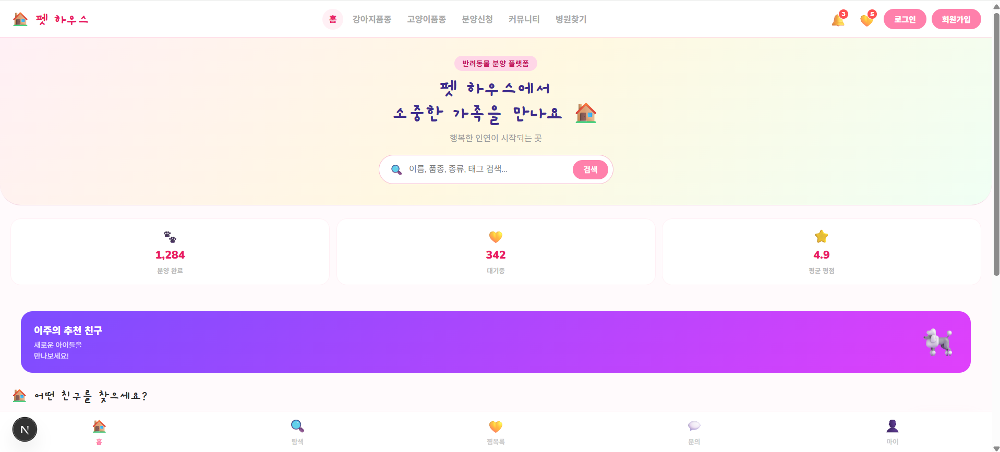
    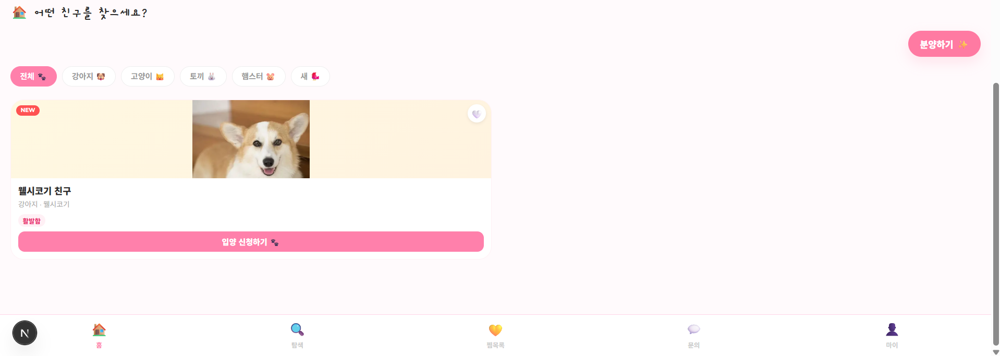
</p>

### 2. 로그인
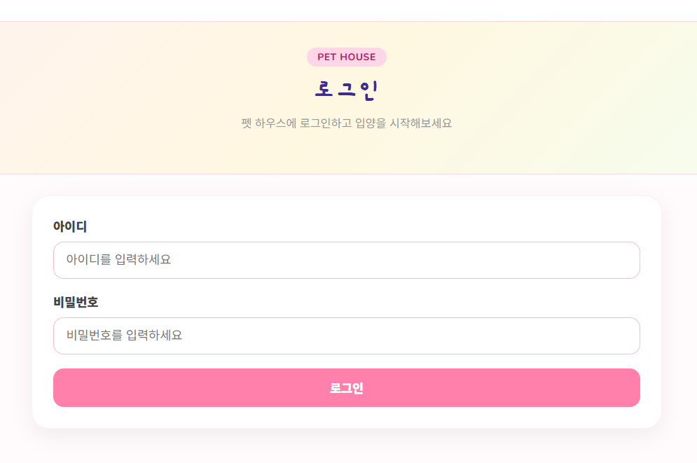

### 3. 회원가입
<p aligin="center">
    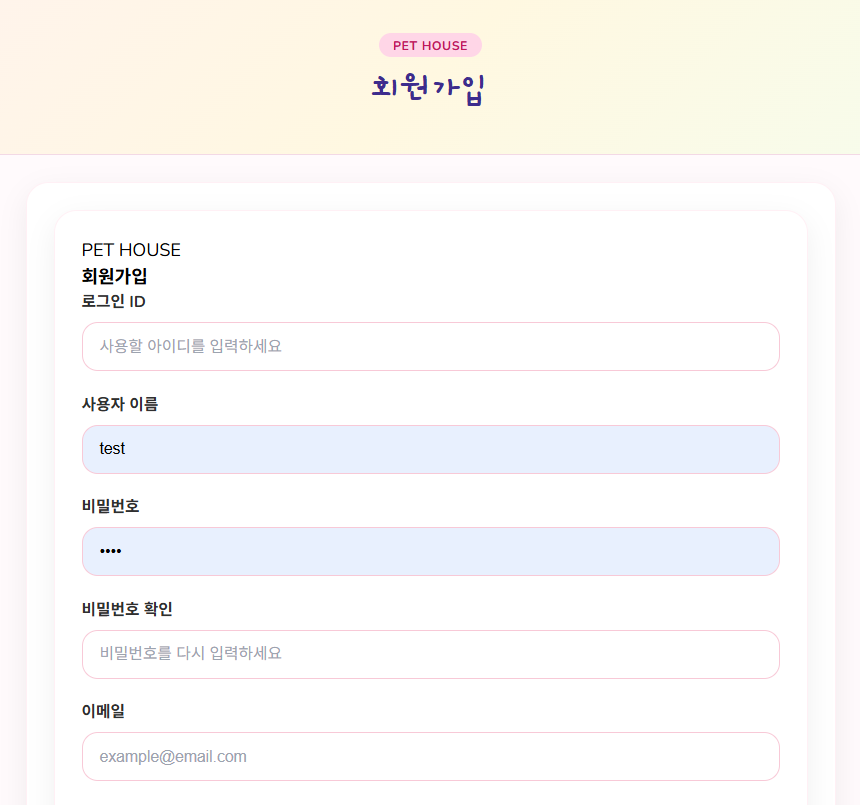
    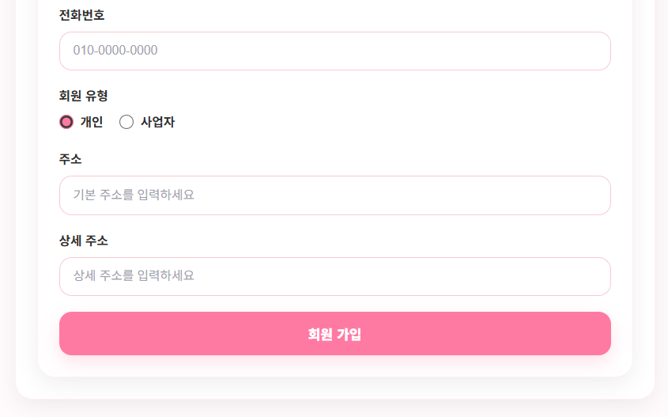
</p>

### 4. 분양 상세 정보
<p aligin="center">
    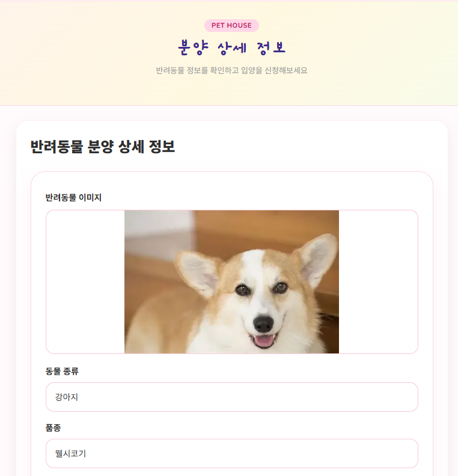
    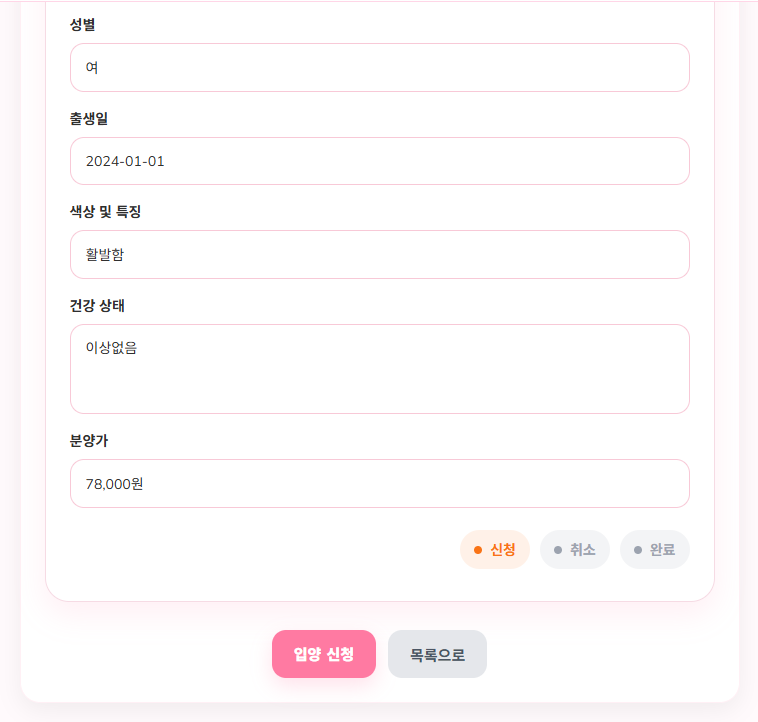
</p>

### 5. 분양 등록
<p aligin="center">
    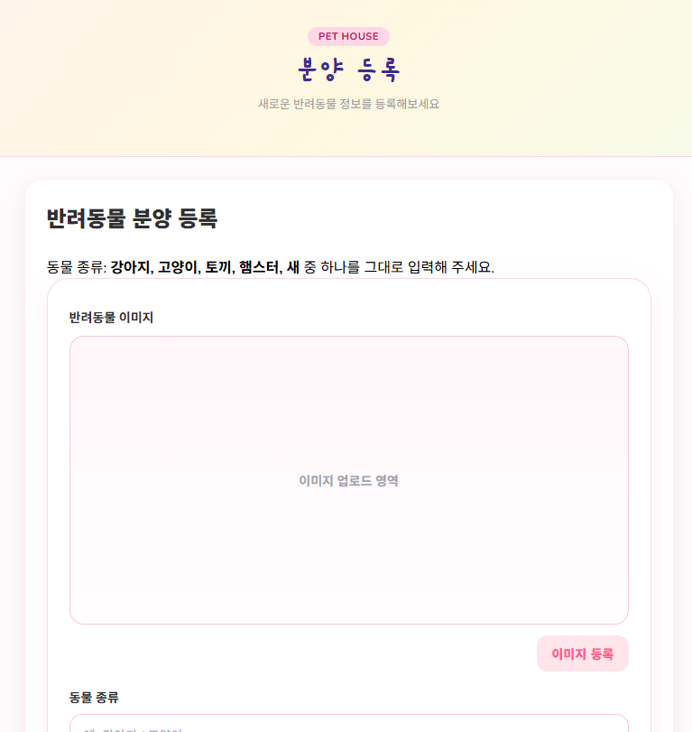
    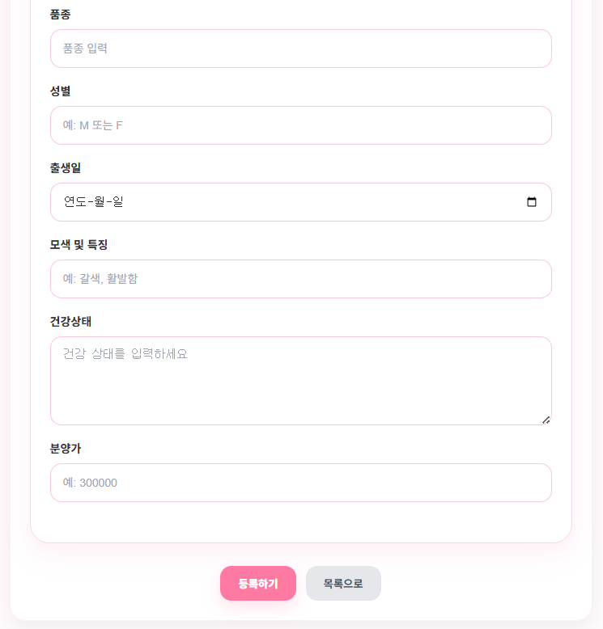
</p>

### 6. 계약 관리(관리자)
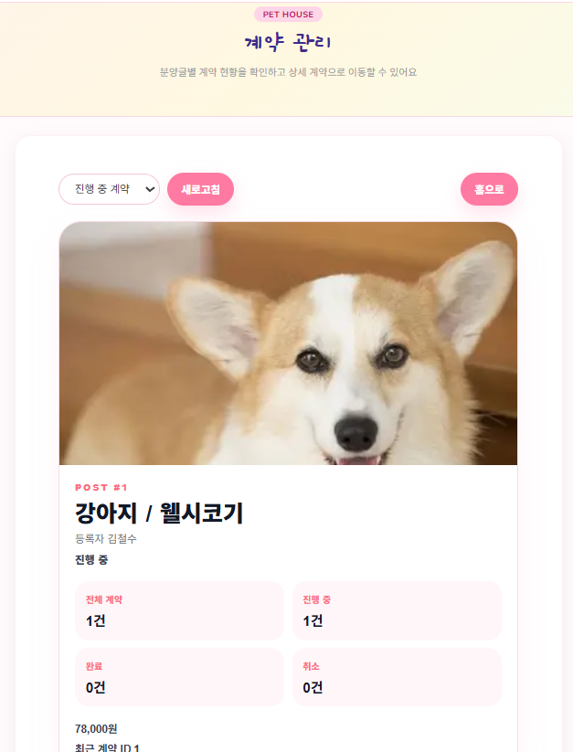

### 7. 계약 상세 관리(관리자)
<p aligin="center">
    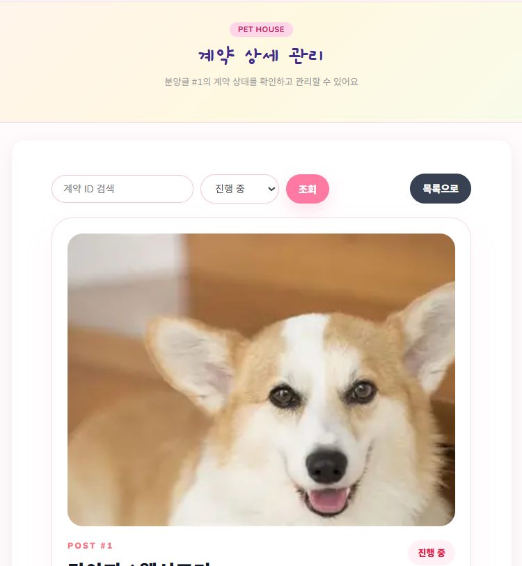
    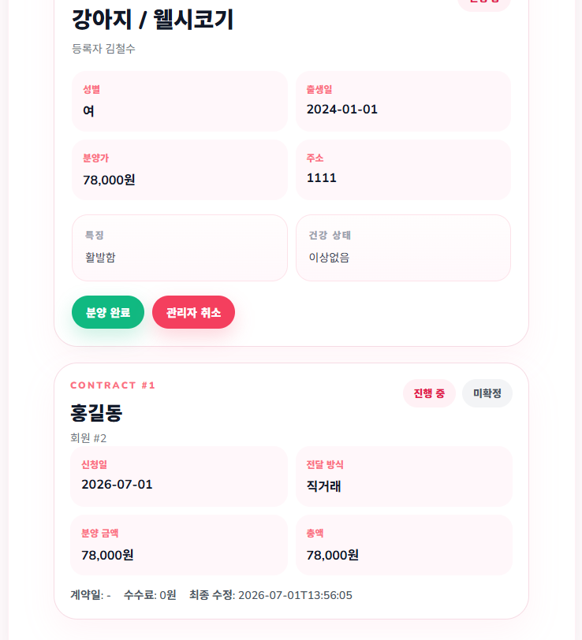
</p>

